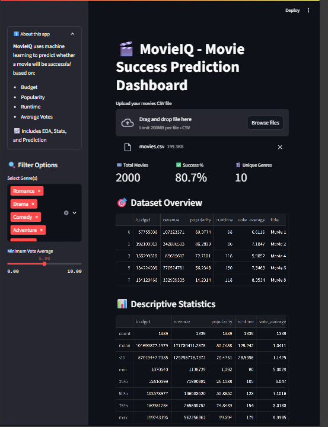
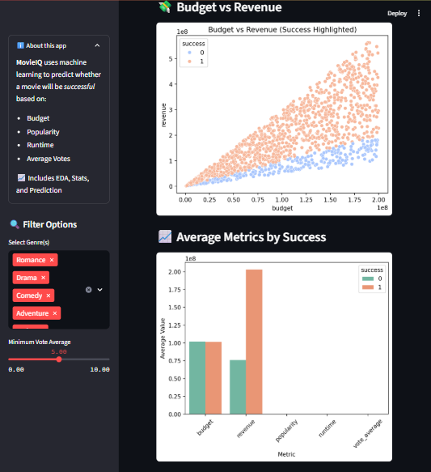
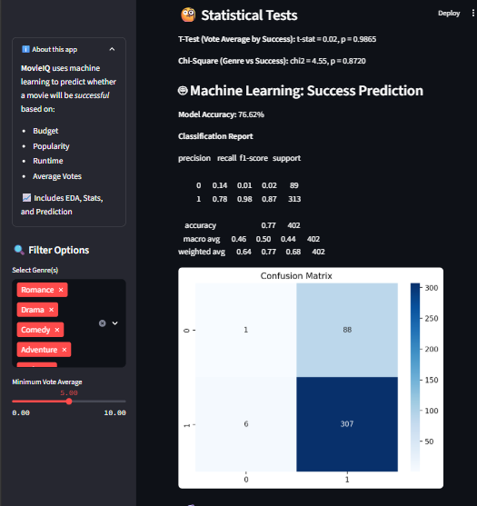
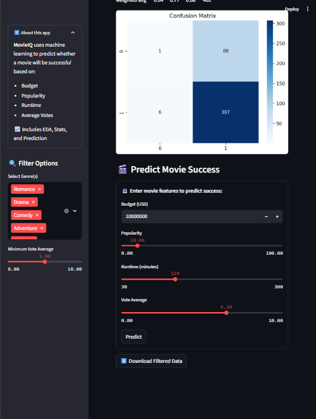

# 🎬 MovieIQ - Predictive Analytics on Film Success

An interactive Streamlit dashboard designed to analyze and predict the financial success of movies. Using key metrics like budget, revenue, and audience scores, it offers insights through data visualization, statistical analysis, and a Random Forest machine learning model.

---

## 📷 Screenshots

| Dashboard Overview | 
|--------------------|
|  |
|  |
|  |
|  |

---

## 📊 Key Features

- 🎯 Predicts whether a movie is likely to be successful (Revenue > Budget)
- 📈 Visual insights using Seaborn & Matplotlib (Budget vs Revenue, Genre Trends)
- 📊 T-Test and Chi-Square statistical tests
- 🤖 Random Forest Classifier for success prediction
- 🧠 Interactive filtering by genre and vote average via sidebar
- 🧼 Clean, modular dashboard ready for deployment

---

## 🧰 Tech Stack

- **Python** 🐍
- **Pandas**, **NumPy**
- **Seaborn**, **Matplotlib**
- **Scikit-learn**
- **Streamlit**
- **SciPy**

---

## 🚀 Run Locally

### 1. Clone the repository
```bash
git clone https://github.com/vedikasharma2801/-Movie-Success-Prediction-Dashboard
 
```
### 2. Install dependencies
```bash
pip install -r requirements.txt
```
### 3. Run the app
```bash
streamlit run MovieIQ.py
```
## 📁 Dataset
Make sure the project includes a `movies.csv` file with the following columns:<br>
` budget, revenue, popularity, runtime, vote_average, title, genres`
<br>
## 👨‍💻 Author<br>
### Vedika Sharma<br>
#### Final Year AI&DS Student | Aspiring Data Analyst<br>

